# Project 4: Locks and Threads

10185102223 汪杰


[TOC]


## 概述

### 任务目标简介

1. 自己实现自旋锁（spinlock）和互斥锁（mutex）
2. 基于各种不同的锁（包括自己实现的锁和系统提供的锁）实现3个线程安全的数据结构：计数器（counter），链表（list），哈希表（hash）
3. 设计测试文件，从多方面测试上述数据结构在多线程环境下的性能。

  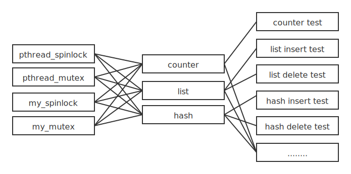

### 总体策略

1. 代码复用
2. 自动化测试

### 文件目录结构

| 顶层文件夹 | 内容                                                         |
| ---------: | :----------------------------------------------------------- |
|    sources | 各种锁的源文件和一些基本组件，以及基于此实现的各种数据结构的源文件 |
|    testers | 对数据结构进行各种测试的源文件和自动化测试脚本，以及一个用于画图的python脚本 |
|       data | 测试文件生成的数据（csv文件），每个测试文件的数据再细分文件夹存放 |


## 实现锁

自旋锁的实现是平凡的，不再赘述。

互斥锁的实现相对困难。我是模仿 futex 帮助文档中的示例代码实现的。

该锁的 **number** 属性的含义和自旋锁是一样的，表示是否占据；而不像linux mutex那样，表示等待队列的长度。

下面是获得锁的代码。我认为这是一个两阶段锁，因为在 futex wait 之前，总会先判断锁是否可用（判断方式与自旋锁相同）。即进入 wait 状态之前会先自旋一次。

```c
void mutex_acquire(mutex_t *lock) {
    long s;
    while (1) {
        /* Is the futex available? */
        if (xchg(&lock->number, LOCK_HELD) == LOCK_FREE)
            return;      /* Yes */

        /* Futex is not available; wait */
        s = futex(&lock->number, FUTEX_WAIT, LOCK_HELD, NULL, NULL, 0);
        if (s == -1 && errno != EAGAIN)
            errExit("futex-FUTEX_WAIT");
    }
}
```

与OSTEP中给出的两阶段锁比较：我认为两者的差别只在于是否记录了队列长度，即 **number** 的含义不同。

```c
void mutex_acquire(mutex_t *lock) {
    int v;
    /* Bit 31 was clear, we got the mutex (the fastpath) */
    // spinlock: spin for one round
    if (atomic_bit_test_set(&lock->number, 31) == 0)
        return;
    // number is the length of wait queue
    atomic_increment(&lock->number);
    while (1) {
        // wake up by release()
        // acquire lock and maintain number (wait queue length)
        if (atomic_bit_test_set(&lock->number, 31) == 0) {
            atomic_decrement(&lock->number);
            return;
        }
        /* We have to waitFirst make sure the futex value
        we are monitoring is truly negative (locked). */
        // others might call release() here (?)
        v = lock->number;
        if (v >= 0)
            continue;
        futex_wait(&lock->number, v);
    }
}
```

下面是释放锁的代码。释放之后总是尝试唤醒一个正在等待的线程（虽然可能不存在等待线程）。由于没有记录等待队列长度，因此无法判断何时需要 futex wake 。记录队列长度的优势，就是避免在不必要时进入系统调用。

```c
void mutex_release(mutex_t *lock) {
    long s;
    if (xchg(&lock->number, LOCK_FREE) == LOCK_HELD) {
        s = futex(&lock->number, FUTEX_WAKE, 1, NULL, NULL, 0);
        if (s  == -1)
            errExit("futex-FUTEX_WAKE");
    }
}
```

那么为什么我没有实现“记录等待队列长度”的互斥锁呢？因为在OSTEP中，atomic_bit_test_set这类函数都只表明功能，不同系统会提供不同的对应实现。而我查阅了各种资料，没有找到在Linux中应该如何使用这些函数，或许定义在 \<stdatomic.h\> 中？以后再说吧。

通常，锁需要提供一个初始化函数，用户不需要知道内部的具体情况。pthread库中的锁就有这样的函数。所以，除了实验要求的获得和释放锁的函数，我还为每个锁实现了初始化函数。


## 实现数据结构

设想一下，如果要为每一个锁实现一个对应的数据结构，那么代码量将会是非常庞大的，同时还不利于调试和修改。

注意到：对于不同的锁，对应的相同数据结构的代码是极其相似的。

- 例如链表删除函数：该函数会先获得锁，然后找到要删除的节点，删除并释放节点内存，最后释放锁。
- 对于不同的锁，只是获得和释放的函数不同，中间的部分（链表操作）都是一样的。

除此之外，在测试时，如果对不同的锁实现了独立的数据结构，那么每种测试都要为 $4\times3=12$ 个数据结构提供不同的代码，而测试部分完全相同。

- 例如测试计数器：不论是那种锁实现的计数器，测试文件只管调用计数器的自增函数。
- 对于不同的锁对应的数据结构，只有类型不同，测试文件的其余部分完全相同。

实际上，相同的部分一般都是代码的主要部分。这就意味着，如果简单地为每个锁生成一份新代码，那么代码之间高度相似。

综上，需要代码复用。

### 通用锁设计

利用C语言的void指针和函数指针，为不同的锁提供统一的接口，从而达到复用的目的。

> 如果是C++，那么会有更优雅的实现方式：抽象类。
>
> 可是C语言不存在面向对象，只能通过特殊技巧，尽可能参照面向对象的思想来设计代码。

下面以计数器（counter）为例，解释通用接口的设计。下面是counter结构体的定义：

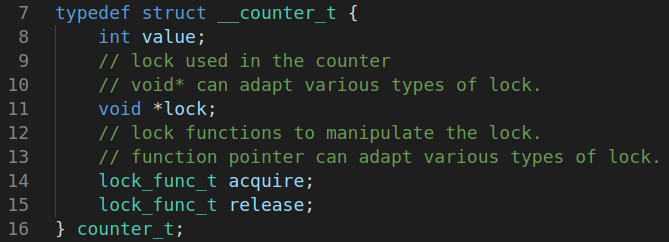

这里的 **lock** 指向某个锁的实例。因为是 void\* 指针，故可以指向任何类型的锁。

 **lock** 后面的 **acquire()** 和 **release()** 是两个函数指针。函数指针可以动态地指向不同的函数，也可以像函数一样被调用。于是，在实现计数器时，获得锁或者释放锁，不再是调用某个具体的函数，而是通过这里函数指针调用函数。这些函数指针具体指向哪个函数，取决于 **lock** 的类型，随之同步变化。

下面来看函数指针类型 `lock_func_t` 的定义：

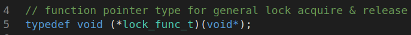

- 这是一个typedef的特殊用法。[如何一句话理解typedef？](https://zhuanlan.zhihu.com/p/81221267) 正如该链接中指出的那样：typedef中声明的类型在变量名的位置出现。如果去掉typedef，那么这是一个函数指针的声明。现在，我们为这个函数指针类型定义了别名。
- 这个函数指针的返回类型是 `void` ，这是理所应当的，因为锁的获得和释放函数都返回 `void` 。
- 它的参数就有一些特殊了。我们知道，锁的获得和释放函数的参数是 *指向锁的指针* ，这个指针的类型是对应的锁的类型，而不是 `void\*` 。类型不匹配，可以互相赋值吗？
  - C语言存在隐式类型转换，例如你可以直接把 `double` 赋值给 `int` 。
  - 但是不同指针类型直接的隐式类型转换是不允许的，例如你不能直接把 `double*` 赋值给 `int*` 。如果你要这么做，必须手动强制类型装换，例如  `int*=(int*)double*` 
- 因此，你可以写出想这样的代码： `acquire = (lock_func_t)spinlock_acquire` 。把参数类型强制转换成 `void*` 。
- 你还可以像这样调用这个函数指针 `c->acquire(c->lock);` ，其中 `c` 是指向 `counter_t` 的指针。这样的代码会从 `counter_t` 结构体中找到 **acquire** 对应的具体函数。
  - 虽然这里传入的锁是 `void*` 类型的，但是进入具体函数后，会自动变成函数声明的对应类型，如 `spinlock_t` 。

有了通用的锁结构，还需要提供一个切换锁的接口，实现在 <u>~/sources/change_lock.c</u> 中。

```c
int change_lock(char *lock_type, void **lock, lock_func_t *acquire, lock_func_t *release) {
    if (strcmp(lock_type, "pthread_mutex") == 0) {
        free(*lock);
        *lock = malloc(sizeof(pthread_mutex_t));
        *acquire = (lock_func_t)pthread_mutex_lock;
        *release = (lock_func_t)pthread_mutex_unlock;
        pthread_mutex_init(*lock, NULL);
        return 0;
    }
    if (strcmp(lock_type, "pthread_spinlock") == 0) {
    // .......
    return -1;
}
```

- 该函数通过字符串识别锁的类型，先把原有的锁释放掉（如果原本不存在锁，那么free(NULL)也是安全的），然后根据锁的类型指定对应的操作函数，最后初始化这个锁。
- 这个函数会被多个数据结构调用，因此抽离出来，放在单独的文件中。
- 注意，该函数的参数是一些二级指针。所以可以直接修改原有的值。
- 于是，你可以像这样调用这个函数，对于不同的数据结构，调用方式基本相同：

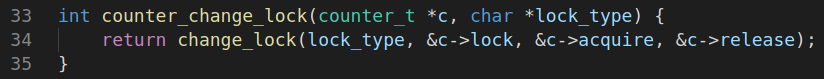

有了通用锁之后，概述中的完全二分图就能简化为下面的样子：

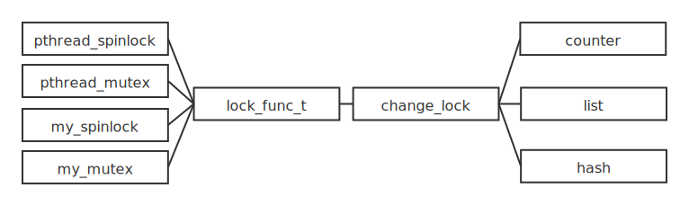

### 链表设计

结构体定义和计数器基本一致。其中 `node_t` 是链表节点结构体。而 `list_t` 则是链表头，负责保证线程安全性。

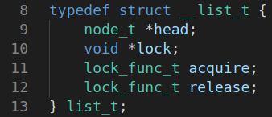

考虑到之后的哈希表中还会用到无锁的链表，所以将普通的链表单独封装在 <u>~/sources/list_node.c</u> 中。

在线程安全的链表实现在 <u>~/sources/list.c</u> 中，直接调用 <u>list_node.c</u> 中的函数完成链表操作，只需要在外面封装一层锁即可。

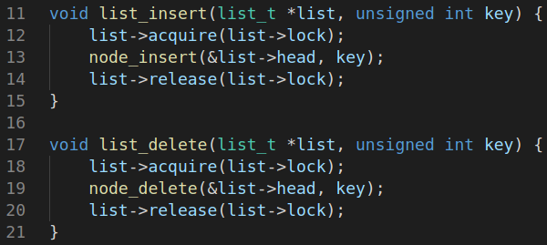

### 哈希表并发性最大化

首先会考虑像链表一样实现哈希表，即：

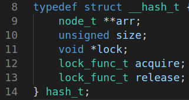

但是这样的实现意味着同一时间只能有一个线程访问哈希表。这样的效率不是最高的。

实际上，哈希表是由多个互不相关的链表组合而成的，由哈希函数负责找到对应的链表，在这之后，所有链表互相独立。因此，可以设计由多个线程安全的链表组成的哈希表，哈希表自身不需要锁，如下所示：

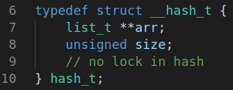

这样，哈希表就能被多个线程同时访问（只要这些线程访问的值被哈希函数定位到了不同的链表上）。

为了比较其效率的差异，我把两种不同的哈希表都实现了。


## 实现测试程序

测试项目繁多：需要测试对不同数据结构做不同操作时，锁、线程数等因素对效率的影响。排列组合一下，工作量庞大。所以，需要自动化测试。

### 测试程序规范

对于每种数据结构上的每种操作，设计一个测试程序。为了方便实现自动化测试，需要对所有测试程序设定一定的规范：

- 该程序应当接收适当的命令行参数，完成不同的工作，如切换锁，改变线程数。
- 该程序只输出这一项任务的线程数和运行时间（按照特定的格式），由之后的自动化测试脚本完成数据的收集与整理工作。
- 此外，测试程序还应该在意料之外的事情发生时及时abort，而非输出错误值。例如在运行结束后检查数据合法性。

所有的测试程序源代码都在 <u>~/testers</u> 中，测试程序命名与含义对应关系如下：

| 程序名 | 含义                                             |
| -----: | ------------------------------------------------ |
|     ct | counter test                                     |
|    lti | list insert test                                 |
|    ltd | list delete test（逆序删除，预期复杂度 $O(1)$ ） |
|  ltdon | list delete test（顺序删除，预期复杂度 $O(n)$ ） |
|    ltr | list random test（随机插入，随机删除）           |
|    hti | hash table insert test（高并发哈希表）           |
|    htr | hash table random test（高并发哈希表）           |
|  hflti | hash table insert test（无并发哈希表）           |
|  hfltr | hash table random test（无并发哈希表）           |
|    hts | hash table scaling test                          |

### 自动化测试脚本

规范化测试程序后，就能设计如下的自动测试shell函数。（在 <u>~/testers/test.sh</u> 中）

```shell
autotest() {
    # rename for readability
    proc=$1
    max_p=$2
    iters=$3
    lock=$4
    folder="../data/${proc}_data"
    file="${proc}_${lock}.csv"
    echo $proc $lock
    echo "cnt_p,time" > $file       # clear file, add table header
    for cnt_p in $(seq 1 $max_p)    # run with different pthread number
    do
        echo running $cnt_p threads
        for epoch in $(seq 1 $iters)        # run several times
        do
            ./$proc $cnt_p $lock >> $file   # redir to the end of the file
        done
    done
    # print results
    # echo ===================
    # echo $file :
    # cat $file
    echo ===================
    mkdir $folder -p       # do not print error if dir already exist
    mv $file $folder/$file
}
```

这个函数会让某个测试程序反复运行多次，对应不同的线程数。对每个线程数还会多次运行。实际执行时，可以根据程序的效率和数据浮动情况动态调整参数。

程序的输出被重定向到数据文件中，完成这组测试后，会把这个文件移动到对应的文件夹下。数据文件的命名是根据程序名和锁类型确定的，数据文件和文件夹的创建都是自动进行的，书写测试命令时无需关心这些事情。

于是，测试命令就能写成这样。

```shell
# counter tests with different locks
autotest ct 50 20 pthread_mutex
autotest ct 50 10 my_mutex
autotest ct 50 40 pthread_spinlock
autotest ct 50 40 spinlock
```

或者这样

```shell
# hash table with full lock insert test
autotest hflti 30 5 pthread_mutex
autotest hflti 30 30 pthread_spinlock
autotest hflti 30 30 spinlock
autotest hflti 30 10 my_mutex
```

### 数据分析和绘图

编写python脚本以完成这一功能，代码在 <u>~/testers/plot.py</u> 中。流程大致为：

1. 给定程序名，按照约定规则，自动解析出该测试程序对应的数据文件路径（包含其在所有的锁上的测试）
2. 通过pandas读入csv文件
3. 处理csv文件，整理出每个线程数对应的若干个运行时间（因为同一个在线程数上运行了多次）
4. 利用numpy计算平均值和标准差
5. 利用matplotlib绘制折线图以及误差线，用半透明点绘制所有数据点的散点图。

### 随机过程稳定性保证

某些测试程序需要提供随机数。例如链表的随机插入和删除实验，需要先随机插入若干个数字，然后以随机的顺序删除这些数字。

- 如果简单地随机插入和随机删除，每次都生成一个随机数，那么会产生各种问题：
  - 可能尝试删除不存在的点
    - 在Linux标准库中， **rand()** 可以生成的最大值是 **INT_MAX** ，远大于插入与删除次数。所以大概率会删除不存在的数字。
  - 每次运行的随机数不同
    - 于是数据点的浮动就会引入随机数的影响。为了控制变量，应当杜绝这种随机性。
- 所以我的随机方案是：
  - 事先生成所有待插入的数字，然后通过 **shuffle()** 函数打乱，作为删除数字的顺序。
    - 这样就只会删除已经存在的数字。
  - 固定随机数种子，而不是用当前时间。
    - 让每次运行的数据是固定不变的随机数。
    - 当然，随着线程数（通过命令行参数输入）的变化，，生成的随机数个数不同，数据也会改变。


## 效率测试与分析

### 多次运行原因分析

每次运行的代码是一样的，那么为什么运行时间会波动呢？

我认为这是因为线程同步导致的。一个线程尝试获得锁时，必须等待另一个线程释放锁。而线程的执行时间是具有随机性的，取决于操作系统何时命令线程释放CPU。

因此，不稳定因素主要是线程之间的相对执行顺序与执行时间。多次运行的主要目的就是消减这一因素的影响，让数据曲线主要表现不同数据结构和不同锁之间的差异。

另外，统计同一设定下，多个运行时间的标准差，这个标准差能够反映锁的稳定性。标准差越小，就说明这种锁不容易受到线程执行中存在的随机性的影响。

### 计数器自增测试

下图的以线程数为横轴，以该线程下的运行时间为纵轴。运行多次，所有数据点用灰色点表示，折线由每种锁的均值链接而成。

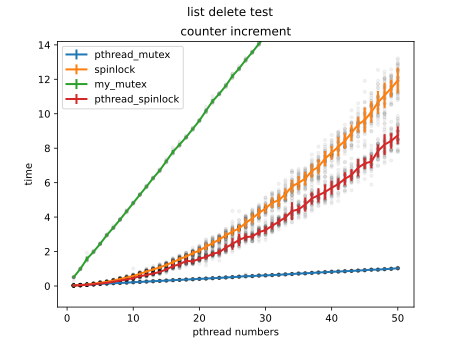

- 测试程序执行时间的增长曲线，随不同的锁，表现出不同的形式，这就意味着不同的复杂度：
  - 首先考虑总任务量的变化规律：随着线程数增加，计算量是增加的（因为每个线程固定自增一定次数），所以计算总量是随线程数线性递增的。
  - 对于mutex锁（不论是我的还是系统的），执行时间都是线性增长的。
    - 这意味着mutex锁的引入没有带来额外复杂度开销（锁的复杂度为 $O(1)$ ）。
  - 而spinlock锁的曲线，二阶导为正，产生了额外开销。我认为这个开销是因为同一时间只有一个线程能运行，其余锁都在空等。分析时间复杂度如下：
    - 假设每个线程都能平等地被调度，设有 $n$ 个线程
    - 那么总体效率为 $\frac 1n$ ，因为平等调度，调度其余 $n-1$  个线程时会空转，浪费CPU
    - 而任务总量随 $n$ 线性增长（因为测试程序是这样设计的）
    - 那么总时间开销就会正比于 $n^2$ （总量除以效率）。即spinlock锁引入的额外复杂度为 $O(n)$ ，其中 $n$ 是线程数
    - 通过MatLab的曲线拟合功能，拟合出总时间开销 $\mathrm{time}\propto n^{1.857}$ 
    - 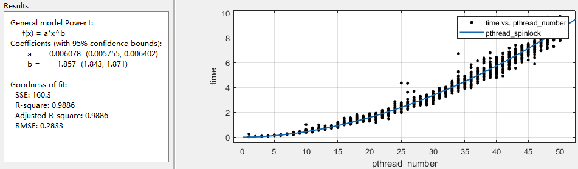
- 不同类型的锁之间存在复杂度的区别，同类型锁之间还存在常数的区别，系统提供的锁总是比我实现的蹩脚的锁要快：
  - my_mutex的常数特别巨大。前面解释锁的实现时我就提到，我认为我实现的mutex锁和OSTEP的锁差不多，我不能理解为什么有如此巨大的性能差异。从另一方面来说，pthread_mutex确实优化到了极致。
  - my_spinlock的效率略低于pthread_spinlock，[这篇文章](https://zhuanlan.zhihu.com/p/75102856)中分析了内核spinlock的实现，看起来涉及不少硬件层面的优化，使效率略微提升了一些。
- 另外，注意到，两种spinlock的标准差都比较大：之前提到，标准差的来源是线程之间互相等待（具有随机性）导致的。
  - spinlock之所以有较大的标准差，是因为线程等待的时候是空等，这一段时间就浪费了，运气好的话，等待时间短，那么总运行时间就短，如果运气差，总运行时间就会较长。
  - mutex之所以有较小的标准差（实际上几乎没有偏差），我认为是因为一旦没有获得锁（自旋一次之后）就会睡觉，释放CPU，而不会无谓地占用CPU。所以不仅整体上效率较高，运行时间也更稳定，即使线程之间存在随机性的不同步，睡觉机制会让CPU快速的回到占据锁的线程上。


### 链表插入测试

每个线程各自插入 $10^6$ 个数字。

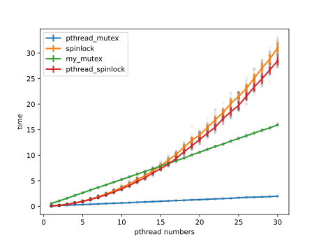

链表的插入操作和计数器自增操作代价几乎相同，复杂度为 $O(1)$ 。


### 链表删除测试

该测试先向链表中依次插入 $1,1,\cdots,1,2,2,\cdots,2,\cdots,\mathrm{maxn},\mathrm{maxn},\cdots,\mathrm{maxn}$ 。每个数字插入的个数和线程个数相同。然后每个线程再对数字 $1,2,3,\cdots,\mathrm{maxn}$ 执行删除操作。本测试中， $\mathrm{maxn}=10^3$ 。

链表删除操作的平均复杂度是 $O(n)$ 的。如果总是从链表头删除（顺序删除），那么复杂度会降到 $O(1)$ 。而从链表末尾删除（逆序删除），复杂度总是 $O(n)$ 。下图比较了两种不同的删除顺序：

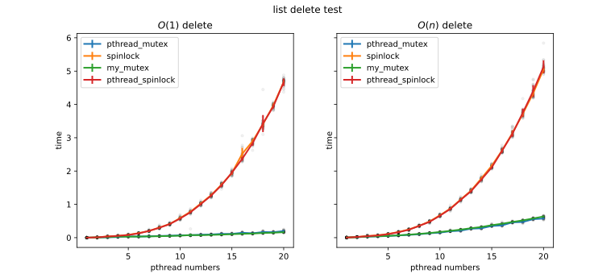

- 我很惊讶：时间开销竟然是差不多的，这和理论分析相去甚远。

  - 上图都执行了1000次删除操作。按照单线程情况下分析的复杂度，两者的性能差距应当有500倍，但是实际情况是 $O(1)$ 删除只比 $O(n)$ 删除略微快一点。

    实际上，如果看线程数为1的数据，那么 $O(1)$ 删除比 $O(n)$ 删除快约30倍（没有达到理论值）。线程数增加后，两者就没有数量级上的差距了。

  - 我对此的解释是：还是由于线程同步问题导致的。考虑 $O(1)$ 删除的多线程版本：

    - 假设有 $n$ 个线程，调度是随机的。
    - 假设在第一次调度中，这个线程删除了 $k$ 个节点。那么每次删除访问的节点个数依次是 $1,n+1,2n+1,\cdots,(k-1)n+1$ 。
    - 随着线程越来越不同步，有一些已经删到很后面，而有一些还停留在开头，这时，删除操作还是需要遍历大量的节点才能找到要删除的对象。
    - 最优情况是每个线程轮流删除一个节点，这样的复杂度就能保持在 $O(1)$ 。但是考虑到线程通常会执行一段时间，一次调度会删除很多个点，且调度还具有随机性，这种最优情况是很难达到的。
    - 于是，即使是 $O(1)$ 删除，由于线程随机调度和执行，其平均复杂度也会退化为 $O(maxn)$ ，其中， $maxn$ 是链表节点个数。

- 我实现的锁和pthread库里的锁效率差不多。

  - 前面的测试中，my_mutex总是有较大的常数，my_spinlock也比pthread_spinlock要慢一些。但是删除测试中（不论何种复杂度），两条线几乎重合，没有明显差异。
  - 这个现象表明：锁的优化不具有主导作用：
    - 时间开销主要花费在程序执行（链表删除）上，锁的性能差别对总体时间的影响不大。
    - 与前面的测试相比，计数器自增和链表插入都是简单操作，执行速度很快，所以优化锁的效率能够显著提升整体效率。
    - 当然这里说的不是锁不影响运行时间，显然spinlock和mutex之间是有区别的。
    - 这里的思想与[Amdahl定律](https://en.wikipedia.org/wiki/Amdahl%27s_law)相同

### 链表随机插入删除测试

插入删除的数的个数（$\mathrm{maxn}$）与链表删除测试是一样的，都是 $10^3$ 。

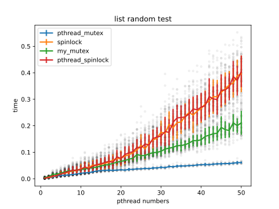

- 虽然标准差看上去很大，但是注意，纵坐标范围是很小的，所以这里的标准差其实和之前的实验差不多。
  - 前面已经提到了随机数的生成策略。多次重复运行的随机数是一样的，即这里的标准差不受随机数影响。
  - 随机数至多能影响删除顺序，这会导致整体性的偏移。
- 随机插入删除的效率竟然如此高？
  - 插入的代价是可以忽略不计的。插入测试中执行了 $10^6$ 次插入，运行时间和删除测试中的 $10^3$ 次删除是同一量级的。
  - 所以我认为，开销集中在随机删除操作。
- 我不能解释上图中的现象。
  - 随机删除的平均复杂度是 $O(n)$ ，即使再快，也应该比 $O(1)$ 删除（顺序删除）要慢吧。
  - 可是上图显示，随机删除的执行速度远比之前的删除测试快。

### 哈希表插入测试

前文提到，哈希表有两种不同的实现方式。左图是为每个链表提供一个锁的实现，而右图是整个哈希表只有一个锁的实现。

该测试中，每个线程都插入 $\mathrm{maxn}=10^5$ 个数字。哈希表大小为 $4096$

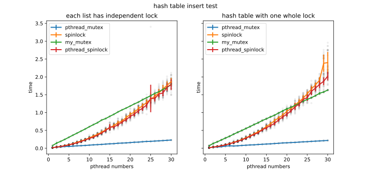

- 每个链表有独立锁的哈希表确实会更快一些。spinlock锁对应的运行时间会快速增长，线程数为50时（运行时间太长，没有详细测试），左图的时间约为5秒，而右图则会增长到10秒左右。

### 哈希表随机插入删除测试

每个线程随机插入删除 $\mathrm{maxn}=10^4$ 个数字。哈希表大小为 $100$ 。

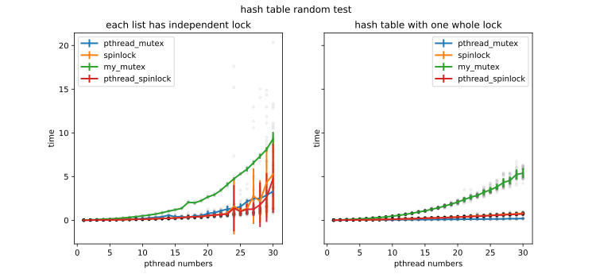

- 为什么左图波动这么剧烈？存在不少10秒以上的数据点，这些点对标准差影响很大。我不能解释这种情况。
- 和哈希表插入测试一样，横坐标30\~50上，spinlock的运行时间剧增，囿于时间原因，没有详细测试。

### 哈希表大小测试

固定线程个数为 $20$ ，变化哈希表的大小。

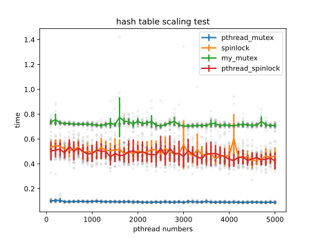

- 哈希表大小对插入效率没有显著影响，因为插入是 $O(1)$ 的。

### 虚拟机单核与多核比较

在VMWare虚拟机上运行测试程序，多核反而比单核慢。我怀疑虚拟机对多核的支持有问题。

- 多核的虚拟机确实占用了更多的计算资源：
  - 我的物理机是四核的。
  - 一开始，虚拟机默认为8核，CPU占用率为100%
  - 虚拟机设置为单核后，物理机CPU占用率为25%
  - 虚拟机设置为双核后，查看物理机CPU占用率，确实达到了50%
- 下面是计数器测试在不同环境下的测试结果。左侧两张图是在我自己的虚拟机上的运行结果，第三张图是我借用好兄弟的服务器运行的结果。

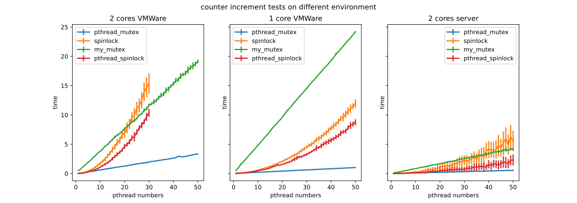

- 可以看到，多核的虚拟机在某些情况下效率更低。而且随着核数的增加（没有画出），效率越来越低。
- 猜测原因可能是：虚拟机在处理多核之间的信息共享时开销过大。导致在正常的物理机上，不会消耗太多资源的事情，在虚拟机上却成为性能瓶颈。

